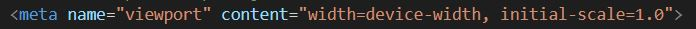
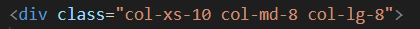

# Responsive Portfolio

## Homework 2
    Create a mobile responsive portfolio using Bootstrap CSS Framework

## Motivation
The task was to use Bootstrap to develop my own portfolio site with the following items:

* A navbar
* A responsive Layout 
* Responsive images
* Using Bootstrap to minimize the use of media queries

## Features

1. By using the Boostrap code, the Navbar is consistent on every page

2. The Navbar on each page contains an About, Contact, and Portfolio link, each that links to their respect page

3. In order to make this page responsive, meaning it can be viewed on several different devices, I used the viewport element:
    
    

    This gives the browser instructions on how to control the page's scaling.

    I also used the class, "column" to set how I wanted the page to look on a small, medium, and large screen:
            
    

4. Each html page uses semantic html by including nav links, a container, rows, columns, and a header and footer. This way it is more accessible and will be able to be used by screenreaders.

5. My page has my own background and artwork, and links to social media.
